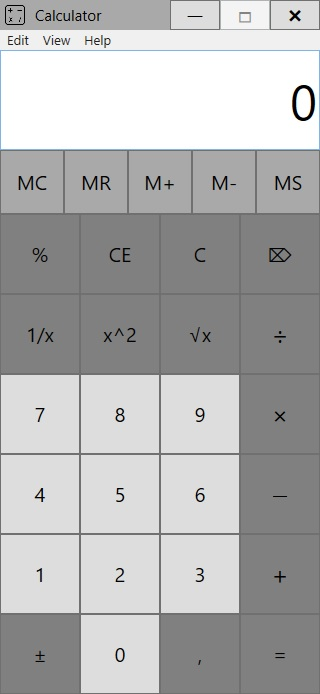
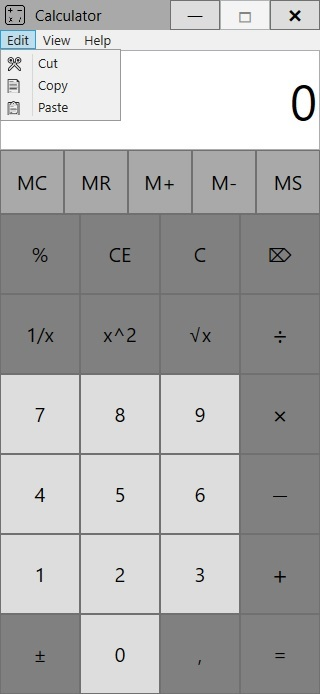
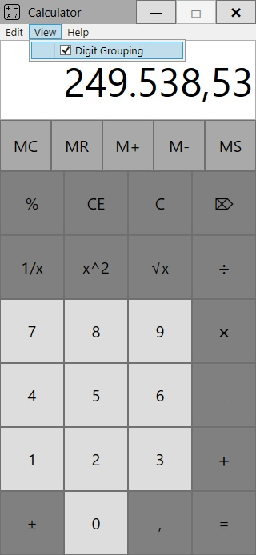
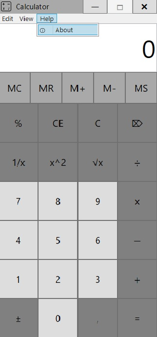
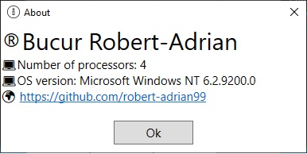
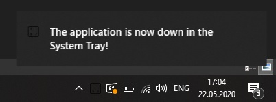

# Calculator-WPF
My version of Calculator made in C# using WPF.

- This project is an implementation of the classic app Calculator in C# using WPF in Visual Studio.
- I created this application as part of the Visual Programming Enviroments' laboratories at the university.
- It was a project I worked on my own.
- The User Interface is pretty simple: it has a bunch of buttons which are organized using a hierarchy of stack panels; the window is not resizable and has a menu.
- The functionality is the same as any calculator; the operations are done in cascade, even percentage.

In my app the TextBox where the output is displayed is read-only and in Edit menu there are Menu Items for Cut, Copy and Paste. For Cut and Copy you have to select the text from TextBox. When Paste is pressed the text from clipboard will be displayed in TextBox if it is a number.

|  |  |
|:---:|:---:|

Another functionality in my app is Digit Grouping. When selected the numbers in TextBox will appear grouped in 3-digit series separated by commas or periods depending on CultureInfo.

Help menu represents some information.

|  |  |
|:---:|:---:|

When Minimize button is pressed the app goes to SystemTray and sends a notification to the user. To maximize the app from SystemTray you have to double click the icon.

